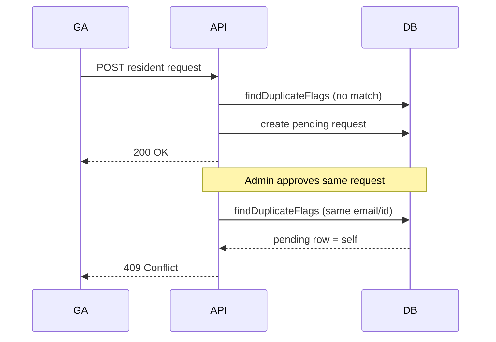

# Resident Request Approve — 409 Duplicate Check Fix

Fix for approving a newly submitted resident request failing with **409 Conflict** even when no real duplicate existed.

**Cursor chat:** [Resident approve 409 fix](a814d9cf-df17-4d66-a88e-5995d5f87078)

---

## How to reopen this chat later

1. **In Cursor** — Open Chat history and search for *409*, *findDuplicateFlags*, or *approve resident*. Transcript ID: `a814d9cf-df17-4d66-a88e-5995d5f87078`.
2. **From the repo** — `@`-mention this file in a new chat.
3. **Transcript file (local)**:

   ```
   ~/.cursor/projects/home-sopuru-Code-next-ra/agent-transcripts/a814d9cf-df17-4d66-a88e-5995d5f87078/a814d9cf-df17-4d66-a88e-5995d5f87078.jsonl
   ```

4. **Related docs** — Broader resident workflow: [_cursor-ai/resident-change-requests-and-editing.md](./resident-change-requests-and-editing.md). Bulk import: [_cursor-ai/bulk-import-and-batch-approval.md](./bulk-import-and-batch-approval.md).

---

## Session flow

| Phase | What happened |
|-------|----------------|
| 1. Report | User added a resident (GA submit) then approved it; server returned **409** with message about duplicate email or student ID. |
| 2. Diagnosis (Ask mode) | Traced `findDuplicateFlags` and `promoteRequestToResident` in `resident-requests.service.ts`. Identified self-match: the pending row being approved counted as its own duplicate. |
| 3. Patch (Agent mode) | Added `excludeRequestId` to `findDuplicateFlags`; approval path passes the current request ID. Removed debug `console.log` calls. |

---

## Problem

**Symptom:** GA (or SA) submits a new resident → admin approves → **409**:

> Cannot approve: duplicate email or student ID in residents or pending queue

**Create succeeded; approve failed** — so the data from the add step was valid. The failure was in approval logic, not duplicate input.

---

## Root cause

`findDuplicateFlags(email, studentId)` checked four sources in parallel:

1. Existing `Resident` by email
2. Existing `Resident` by student ID
3. Pending request by email (`status: "pending"`)
4. Pending request by student ID (`status: "pending"`)

On **create**, that behavior is correct — block a second submission while one is already pending.

On **approve**, `promoteRequestToResident` ran the same check **before** setting `status: "approved"`. The request being approved was still `pending`, so queries (3) and (4) matched **that same document**. `dupes.email` and `dupes.studentId` were always `true` → guaranteed 409.



---

## Fix applied in this session

### `findDuplicateFlags`

Added optional third argument:

```ts
options?: { excludeRequestId?: string }
```

When `excludeRequestId` is set, pending lookups use:

```ts
{ email, _id: { $ne: excludeRequestId }, status: "pending" }
```

(and the same for `studentId`).

### `promoteRequestToResident`

Passes the ID of the request under review:

```ts
const dupes = await findDuplicateFlags(request.email, request.studentId, {
  excludeRequestId: requestId,
});
```

### Unchanged behavior

- **Create** still calls `findDuplicateFlags` without `excludeRequestId` — all pending rows count.
- **409 on approve** still fires when:
  - A `Resident` already has that email or student ID, or
  - A **different** pending request shares email or student ID.

### Cleanup

Removed temporary `console.log` debugging in `findDuplicateFlags` and `promoteRequestToResident`.

---

## Files touched (this session)

| File | Change |
|------|--------|
| `server/src/services/housing/resident-requests.service.ts` | `findDuplicateFlags` + `promoteRequestToResident` (patched here; see note below) |

**API surface (at time of bug):**

| Step | Route / handler |
|------|-----------------|
| GA submit | `POST api/ga/resident-requests` → `createResidentRequest` |
| Admin approve | `POST api/admin/resident-requests/:id/approve` → `promoteRequestToResident` |

---

## Current codebase (after later refactor)

The repo later consolidated addition/update/remove into **`ResidentChangeRequest`** and **`resident-change-requests.service.ts`** (see [_cursor-ai/resident-change-requests-and-editing.md](./resident-change-requests-and-editing.md)). `resident-requests.service.ts` was removed.

The same `excludeRequestId` pattern lives on in the successor service:

| Function | Duplicate check |
|----------|-----------------|
| `approveAddRequest` | `findDuplicateFlags(..., { excludeRequestId: String(request._id) })` |
| `approveUpdateRequest` | `findDuplicateFlags(..., { excludeRequestId, excludeResidentId })` — also excludes the resident being updated from resident-table lookups |
| `createResidentChangeRequest` | `findDuplicateFlags` with no exclude (strict) |

`promoteRequestToResident` is exported as an alias of `approveResidentChangeRequest` for backward compatibility.

If approve still 409s after this fix, check for a **real** duplicate (existing resident or second pending request) or room-capacity errors (`assertRoomHasVacancy`, 422/409 depending on path).

---

## Manual test checklist

1. GA submits a **new** resident (unique email + student ID) → **200**, request is `pending`.
2. Admin approves that request → **200**, resident appears in list; request is `approved`.
3. Submit again with same email or student ID → **409** on create (expected).
4. Create two pending requests with same email (if possible via race/manual DB) → second create or approve of duplicate should **409**.
5. Bulk batch: approve batch where all rows are unique → all succeed (see bulk-import doc).

---

## Takeaway

Shared duplicate helpers used at **both** submit and approve must not treat the **current** pending record as a collision. Use `excludeRequestId` (and for updates, `excludeResidentId`) on approval paths only.
